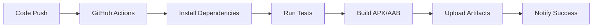

# 🚀 Free React Native & Expo CI/CD Builder

[](https://github.com/marketplace/actions/react-native-expo-builder)
[](https://opensource.org/licenses/MIT)
[](https://github.com/TanayK07/expo-react-native-cicd/pulls)
[](https://github.com/TanayK07/expo-react-native-cicd/stargazers)
[](https://github.com/TanayK07/expo-react-native-cicd/issues)


## 📹 Demo Video

https://github.com/user-attachments/assets/bd1dd6dc-04b6-4b22-91c3-13721b2220e0

*See how to set up your free CI/CD pipeline in under 5 minutes*


**Save $100s monthly on Expo EAS build costs!** 🔥 Build, test, and deploy your React Native/Expo apps directly with GitHub Actions - no paid EAS subscription required.

## 🎯 Why This Tool?

| EAS Build Plans | This Solution | Monthly Savings |
|----------------|---------------|----------------|
| Free Plan: 30 builds/month | ∞ Unlimited builds | $0 → $∞ value |
| Production: $99/month | $0 | **$1,188/year** |
| Priority: $299/month | $0 | **$3,588/year** |

## ✨ Key Benefits

- 💰 **Free Alternative to EAS Build Plans**: Skip the $15-299/month EAS build plans
- 🔄 **Complete CI/CD Pipeline**: Automated testing, building, and deployment
- 📱 **Multiple Build Formats**: Generate development builds, production APKs and AABs
- ☁️ **Flexible Storage Options**: Deploy to GitHub Releases, Google Drive, Zoho Drive, or any rclone-supported storage
- 🛠️ **Customizable Workflow**: Choose only the components you need
- ⚡ **Zero Configuration Option**: Get started with a single click
- 🔒 **Secure**: Builds run on GitHub's secure infrastructure
- 🌐 **Open Source**: Fully transparent and customizable

## 🚀 Quick Start

### Option 1: Use Our Workflow Generator (Recommended)
1. 🌐 Visit our [Interactive Workflow Generator](https://expobuilder.vercel.app/)
2. 🛠️ Configure your build preferences (storage, build types, tests)
3. 📋 Copy the generated workflow file
4. 📁 Save it as `.github/workflows/react-native-cicd.yml` in your repository
5. 🔑 Add your `EXPO_TOKEN` in repository settings → Secrets and variables → Actions

### Option 2: Manual Setup
1. Go to the [Actions tab](../../actions) in your repository
2. Search for "React Native Expo Builder"
3. Click "Configure"
4. Commit the workflow to your repository
5. Add your Expo token in repository settings

That's it! Your next push to the main branch will trigger automatic builds.

## 📋 Configuration Options

### 🏗️ Build Types
- **Development Build**: Debug APK for testing
- **Production APK**: Release-ready APK for sideloading
- **Production AAB**: App Bundle for Google Play Store

### 📤 Storage Destinations
- **GitHub Releases**: Automatic versioned releases
- **GitHub Artifacts**: 7-day retention (free)
- **Google Drive**: Cloud storage with sharing
- **Zoho Drive**: Enterprise cloud storage
- **Custom rclone**: Any rclone-supported storage

### 🧪 Quality Checks
- **TypeScript**: Type checking
- **ESLint**: Code quality and standards
- **Prettier**: Code formatting

### 🔄 Triggers
- **Push Events**: Automatic builds on code changes
- **Pull Requests**: Build verification for PRs
- **Manual Dispatch**: On-demand builds

## 🎥 Demo & Examples

### Live Examples
- [Sample React Native App with CI/CD](link-to-example-repo)
- [Expo TypeScript Template](link-to-expo-example)

### Build Output Examples
```
✅ TypeScript Check - 2m 15s
✅ ESLint - 1m 32s
✅ Prettier Check - 0m 45s
✅ Development APK - 8m 20s
✅ Production APK - 9m 15s
✅ Production AAB - 10m 05s
📤 Uploaded to Google Drive
```

## 🧰 Advanced Setup

For advanced configurations and custom setups:
- 📖 [Detailed Documentation](https://expobuilder.vercel.app/docs)
- 🎛️ [Workflow Generator](https://expobuilder.vercel.app)


##  How It Works



1. **Triggers**: GitHub Actions detects code changes or manual triggers
2. **Environment**: Spins up Ubuntu runner with Node.js and required tools
3. **Dependencies**: Installs project dependencies and EAS CLI
4. **Testing**: Runs TypeScript, ESLint, and Prettier checks
5. **Building**: Uses EAS CLI to build locally on the runner
6. **Deployment**: Uploads artifacts to your chosen storage destination

## 💡 Success Stories

> "Saved $75/month by switching from EAS Build Premium to this GitHub Action. Setup took less than 10 minutes!" - **Alex M., Mobile Developer**

> "Perfect for our startup. We can now build unlimited times without worrying about costs." - **Sarah K., CTO at TechStart**

> "The workflow generator made customization super easy. Love the flexibility!" - **Mike R., React Native Developer**

## 🛡️ Security & Privacy

- ✅ **No Data Collection**: We don't collect or store any of your code or build data
- ✅ **Secure Builds**: All builds run on GitHub's secure infrastructure
- ✅ **Token Safety**: Your Expo tokens are securely stored in GitHub Secrets
- ✅ **Open Source**: Full transparency - review our code anytime

## 🆚 Comparison with Alternatives

| Feature | This Solution | EAS Build | Bitrise | CircleCI |
|---------|---------------|-----------|---------|----------|
| **Cost** | Free | $99-299/month | $36-110/month | $30-200/month |
| **Build Minutes** | Unlimited* | Limited by plan | Limited by plan | Limited by plan |
| **Setup Time** | 5 minutes | 10 minutes | 30 minutes | 45 minutes |
| **Customization** | Full control | Limited | Medium | High |
| **Storage Options** | Multiple | EAS only | Limited | Limited |


<div align="center">

**⭐️ If this action saved you time or money, consider starring the repo!**

Made with ❤️ by [Tanay Kedia](https://github.com/TanayK07)

[⬆ Back to Top](#-free-react-native--expo-cicd-builder)

</div>
